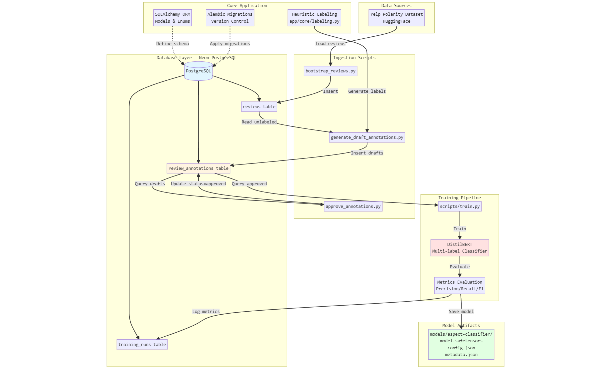

# System Architecture

## Overview

Restaurant Inspector follows a **database-backed annotation workflow architecture** for aspect-based sentiment analysis. The system uses PostgreSQL for structured data storage, SQLAlchemy ORM for database operations, and DistilBERT for multi-label classification.

## Architecture Diagram



**Key Flow**: Yelp Dataset → Bootstrap Script → Reviews DB → Generate Drafts → Annotations DB → Approve → Train → Model Artifacts
    
    subgraph "Core Application"
        ORM[SQLAlchemy ORM<br/>Models & Enums]
        MIG[Alembic Migrations<br/>Version Control]
        LABEL[Heuristic Labeling<br/>app/core/labeling.py]
    end
    
    subgraph "Training Pipeline"
        TR[scripts/train.py]
        ML[DistilBERT<br/>Multi-label Classifier]
        EVAL[Metrics Evaluation<br/>Precision/Recall/F1]
    end
    
    subgraph "Model Artifacts"
        MODEL[models/aspect-classifier/<br/>model.safetensors<br/>config.json<br/>metadata.json]
    end
    
    DS -->|Load reviews| S1
    S1 -->|Insert| T1
    T1 -->|Read unlabeled| S2
    LABEL -->|Generate labels| S2
    S2 -->|Insert drafts| T2
    T2 -->|Query drafts| S3
    S3 -->|Update status=approved| T2
    
    ORM -.->|Define schema| DB
    MIG -.->|Apply migrations| DB
    
    T2 -->|Query approved| TR
    TR -->|Train| ML
    ML -->|Evaluate| EVAL
    EVAL -->|Save model| MODEL
    EVAL -->|Log metrics| T3
    
    style DB fill:#e1f5ff
    style ML fill:#ffe1e1
    style MODEL fill:#e1ffe1
    style T2 fill:#fff4e1
```

## Architecture Layers

### 1. Data Sources Layer

**Yelp Polarity Dataset**:
- **Source**: HuggingFace Datasets (`yelp_polarity`)
- **Size**: 560,000 reviews (we use 300-500 samples)
- **Format**: JSON with `text` and binary `label`
- **Purpose**: Training data for restaurant reviews

### 2. Database Layer (Neon PostgreSQL)

**Platform**: Neon (serverless PostgreSQL hosting)
- **Connection**: Via DATABASE_URL environment variable
- **Features**: Connection pooling, automatic backups
- **Access**: SQLAlchemy 2.0 ORM

**Schema Tables**:

**`reviews`** - Raw review storage
```sql
CREATE TABLE reviews (
    id SERIAL PRIMARY KEY,
    source VARCHAR(50) NOT NULL,
    source_review_id VARCHAR(255),
    review_text TEXT NOT NULL,
    overall_sentiment INTEGER,
    language_code VARCHAR(8) DEFAULT 'en',
    business_name VARCHAR(255),
    business_location VARCHAR(255),
    ingested_at TIMESTAMP WITH TIME ZONE DEFAULT NOW(),
    created_at TIMESTAMP WITH TIME ZONE DEFAULT NOW(),
    updated_at TIMESTAMP WITH TIME ZONE DEFAULT NOW()
);
```

**`review_annotations`** - Aspect-level labels with audit trails
```sql
CREATE TABLE review_annotations (
    id SERIAL PRIMARY KEY,
    review_id INTEGER REFERENCES reviews(id) ON DELETE CASCADE,
    
    -- 5 aspects × 4-state labels
    food_state aspect_state NOT NULL,
    service_state aspect_state NOT NULL,
    hygiene_state aspect_state NOT NULL,
    parking_state aspect_state NOT NULL,
    cleanliness_state aspect_state NOT NULL,
    
    -- Workflow tracking
    annotation_status annotation_status NOT NULL DEFAULT 'draft',
    label_source label_source NOT NULL DEFAULT 'heuristic',
    
    -- Audit trail
    annotator_name VARCHAR(100) NOT NULL,
    reviewer_name VARCHAR(100),
    review_notes TEXT,
    confidence_score NUMERIC(4,3),
    reviewed_at TIMESTAMP WITH TIME ZONE,
    
    created_at TIMESTAMP WITH TIME ZONE DEFAULT NOW(),
    updated_at TIMESTAMP WITH TIME ZONE DEFAULT NOW()
);
```

**`training_runs`** - Model training metadata
```sql
CREATE TABLE training_runs (
    id SERIAL PRIMARY KEY,
    model_name VARCHAR(255) NOT NULL,
    training_samples INTEGER NOT NULL,
    test_accuracy NUMERIC(5,4) NOT NULL,
    test_f1 NUMERIC(5,4) NOT NULL,
    test_precision NUMERIC(5,4) NOT NULL,
    test_recall NUMERIC(5,4) NOT NULL,
    output_path VARCHAR(512) NOT NULL,
    trained_at TIMESTAMP WITH TIME ZONE DEFAULT NOW(),
    created_at TIMESTAMP WITH TIME ZONE DEFAULT NOW()
);
```

**Enum Types**:
- `aspect_state`: positive, negative, mixed, not_mentioned
- `annotation_status`: draft, reviewed, approved, rejected
- `label_source`: heuristic, manual, heuristic_reviewed

### 3. Ingestion Scripts Layer

**`scripts/bootstrap_reviews.py`**:
- Loads Yelp reviews from HuggingFace
- Inserts into `reviews` table
- Deduplicates by `source_review_id`
- Command: `python scripts/bootstrap_reviews.py --count 300`

**`scripts/generate_draft_annotations.py`**:
- Reads unlabeled reviews from database
- Applies heuristic keyword labeling
- Creates `review_annotations` with status='draft'
- Command: `python scripts/generate_draft_annotations.py --limit 300`

**`scripts/approve_annotations.py`**:
- Lists draft annotations for review
- Marks annotations as approved/rejected
- Updates `reviewed_at` and `reviewer_name`
- Command: `python scripts/approve_annotations.py --approve-count 200`

### 4. Core Application Layer

**SQLAlchemy ORM** (`app/db/models.py`):
- `Review` model - maps to reviews table
- `ReviewAnnotation` model - maps to review_annotations table
- `TrainingRun` model - maps to training_runs table
- Relationships: `Review.annotations` one-to-many
- Enum serialization with `values_callable`

**Alembic Migrations** (`alembic/`):
- Version control for database schema
- Current migrations:
  - `20260323_0001` - Initial schema (reviews + annotations)
  - `5eed963bbc03` - Add training_runs + reviewer_name
- Command: `alembic upgrade head`

**Heuristic Labeling** (`app/core/labeling.py`):
- `infer_aspect_states()` function
- Keyword-based aspect detection
- Returns 4-state labels per aspect
- Keywords: food (delicious, tasty), service (friendly, rude), etc.

### 5. Training Pipeline Layer

**`scripts/train.py`** - Main training script:

**Workflow**:
1. Query approved annotations from database
2. Convert 4-state labels → 10 binary labels (5 aspects × 2 sentiments)
3. Split data: 60% train / 20% val / 20% test
4. Tokenize with DistilBERT tokenizer (max_length=128)
5. Fine-tune DistilBERT for multi-label classification
6. Evaluate on held-out test set
7. Save model to `models/aspect-classifier/`
8. Log metrics to `training_runs` table

**Model**: DistilBERT-base-uncased
- 66 million parameters
- 6 transformer layers
- 768 hidden dimensions
- Multi-label classification head (10 output neurons)

**Training Configuration**:
- Epochs: 3
- Batch size: 8
- Learning rate: Default Transformers schedule
- Optimizer: AdamW
- Device: CPU (or GPU if available)

**Evaluation Metrics**:
- Accuracy (exact match across all labels)
- Precision (micro-averaged)
- Recall (micro-averaged)
- F1 Score (micro-averaged)

### 6. Model Artifacts Layer

**Output Directory**: `models/aspect-classifier/`

**Files**:
- `model.safetensors` - Model weights (255MB)
- `config.json` - Model configuration
- `tokenizer.json` - Tokenizer vocabulary
- `metadata.json` - Training metadata (samples, metrics, labels)
- `training_args.bin` - Training hyperparameters

**Metadata Example**:
```json
{
  "model_name": "distilbert-base-uncased",
  "num_labels": 10,
  "label_names": [
    "food_positive", "food_negative",
    "service_positive", "service_negative",
    "hygiene_positive", "hygiene_negative",
    "parking_positive", "parking_negative",
    "cleanliness_positive", "cleanliness_negative"
  ],
  "training_samples": 120,
  "test_metrics": {
    "accuracy": 0.0,
    "precision": 0.0922,
    "recall": 0.7714,
    "f1": 0.1646
  }
}
```

## Data Flow

### Annotation Workflow
```
Yelp Dataset → bootstrap_reviews.py → reviews table
                                           ↓
                          generate_draft_annotations.py
                                           ↓
                        review_annotations (status=draft)
                                           ↓
                           approve_annotations.py
                                           ↓
                       review_annotations (status=approved)
                                           ↓
                               scripts/train.py
                                           ↓
                          Trained DistilBERT Model
                                           ↓
                              training_runs table
```

### Training Data Pipeline
```
Approved Annotations (200)
         ↓
60/20/20 Split (120 train / 40 val / 40 test)
         ↓
4-state labels → 10 binary labels
         ↓
Tokenization (max_length=128)
         ↓
DistilBERT Fine-tuning (3 epochs)
         ↓
Test Set Evaluation
         ↓
Model + Metrics Saved
```

## Design Decisions

### Why PostgreSQL?
- **Structured schema** for relational data (reviews → annotations)
- **ACID compliance** for audit trails
- **Enum types** for validated state transitions
- **Foreign keys** ensure referential integrity

### Why SQLAlchemy ORM?
- **Type safety** with Python type hints
- **Migrations** via Alembic for schema evolution
- **Query abstraction** for database-agnostic code
- **Relationship management** (one-to-many, lazy loading)

### Why 4-State Labeling?
- **Tetralemma logic**: positive / negative / mixed / not_mentioned
- **Captures nuance**: "Food was great but service was terrible"
- **Binary decomposition**: Mixed → both positive AND negative active
- **Flexible**: Can aggregate to 3-state or 2-state if needed

### Why Heuristic + Human Approval?
- **Fast bootstrapping**: Generate 300 drafts in seconds
- **Quality control**: Human review ensures accuracy
- **Scalable**: Approve in batches, prioritize by confidence
- **Auditable**: Track who approved what and when

### Why DistilBERT?
- **Lightweight**: 66M params vs 110M (BERT-base)
- **Fast inference**: 60% faster, 40% smaller
- **High performance**: 97% of BERT-base accuracy
- **CPU-friendly**: Runs efficiently without GPU

## Scalability Considerations

**Current Scale** (March 2026):
- 300 reviews
- 200 approved annotations
- 1 model trained

**Future Scale** (Target):
- 10,000+ reviews
- 5,000+ approved annotations
- Multiple model versions

**Optimizations Needed**:
- Database indexing on `annotation_status`, `review_id`
- Connection pooling for concurrent script execution
- Batch annotation approval UI
- Model versioning with git tags
- Hyperparameter tracking (MLflow or Weights & Biases)

### 7. Model Training (Offline)
- **Dataset**: Yelp Polarity (1500 samples)
- **Labeling**: Rule-based keyword extraction
- **Training**: 2 epochs, batch size 8
- **Fine-tuning**: From pretrained DistilBERT
- **Upload**: Automated to HF Hub via `huggingface_hub` library

## Data Flow

1. **Startup Phase**:
   - FastAPI app initializes
   - Downloads model from HF Hub (cached locally)
   - Loads model into Transformers pipeline
   - Server ready to accept requests

2. **Request Phase**:
   - Client sends POST request with review text
   - FastAPI validates request (Pydantic)
   - Text passed to model pipeline
   - Model tokenizes and classifies
   - Scores aggregated and formatted
   - JSON response returned to client

## Key Design Decisions

### Why HF Spaces?
- **Free tier**: 2GB RAM (sufficient for DistilBERT)
- **Native ML support**: Optimized for Transformers models
- **Auto-deployment**: Git push triggers rebuild
- **Model caching**: Fast cold starts after first load

### Why FastAPI?
- **Performance**: Async support, fast request handling
- **Developer Experience**: Auto-generated docs, type safety
- **Modern**: Built on Starlette and Pydantic
- **Standards**: OpenAPI/Swagger compliance

### Why DistilBERT?
- **Size**: 40% smaller than BERT, 60% faster
- **Performance**: Retains 97% of BERT's language understanding
- **Memory**: Fits in 2GB RAM with headroom
- **Inference Speed**: ~100ms per review on CPU

### Why HF Hub for Model Storage?
- **Version Control**: Git-based model versioning
- **CDN**: Fast global downloads
- **Integration**: Native Transformers support
- **Free**: Unlimited public model hosting

## Scalability Considerations

### Current Limitations
- **Concurrency**: Single instance, CPU-bound
- **Memory**: 2GB limit on free tier
- **Cold Start**: ~30 seconds on first request
- **Rate Limiting**: HF Spaces community tier limits

### Scaling Options
1. **Horizontal**: Deploy multiple HF Spaces with load balancer
2. **Vertical**: Upgrade to HF Spaces Pro (16GB RAM, GPU)
3. **Hybrid**: Use HF Inference API for auto-scaling
4. **Self-hosted**: Deploy on AWS/GCP with autoscaling

## Security

- **Authentication**: None (public API)
- **HTTPS**: Enforced by HF Spaces
- **Input Validation**: Pydantic models
- **Rate Limiting**: HF Spaces platform-level
- **Secrets**: No sensitive data in responses

## Monitoring

- **Logs**: Available in HF Spaces dashboard
- **Health Check**: `/health` endpoint
- **Metrics**: HF Spaces provides basic metrics
- **Errors**: Logged to stdout/stderr

## Deployment URL

**Production**: https://dpratapx-restaurant-inspector-api-dev.hf.space
