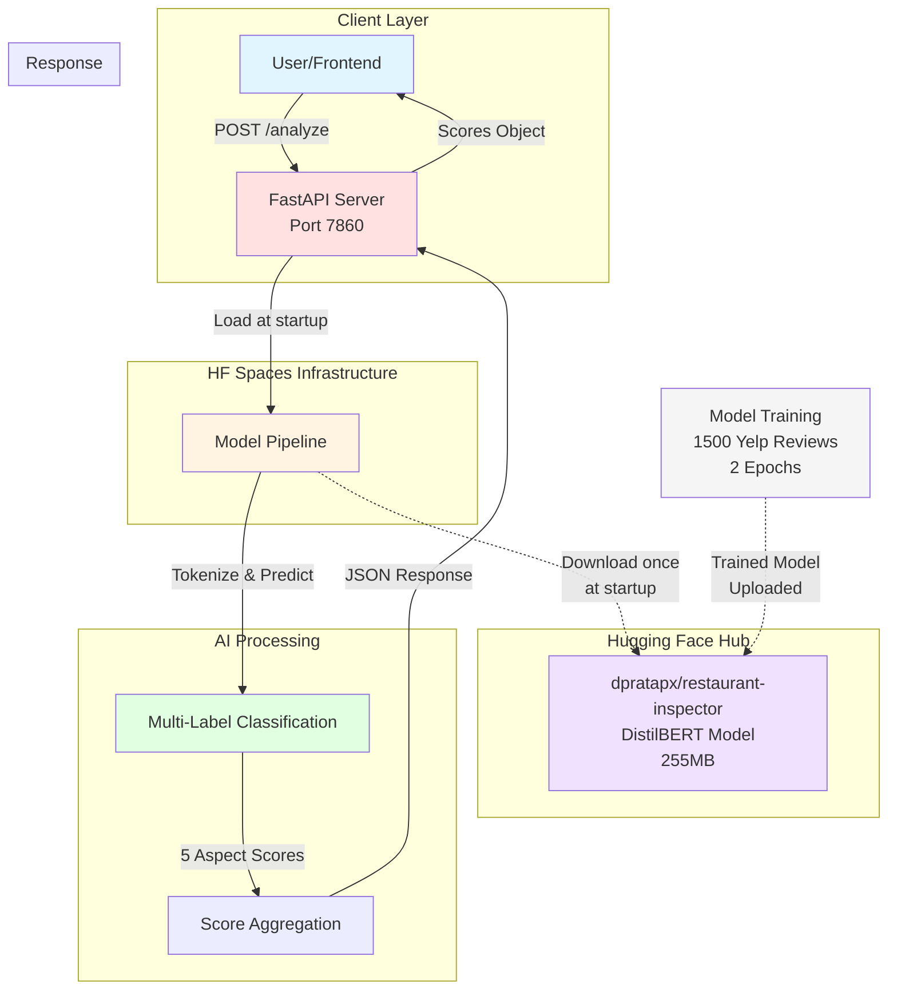

# System Architecture

## Overview

The Restaurant Inspector API follows a **serverless microservices architecture** deployed on Hugging Face Spaces. The system is designed for real-time restaurant review analysis using AI/ML models.

## Architecture Diagram

## Component Description

### 1. Client Layer
- **User/Frontend**: Any HTTP client (web app, mobile app, Postman, cURL)
- **Communication**: REST API via POST requests with JSON payloads
- **Endpoints**: `/health` (GET), `/analyze` (POST)

### 2. HF Spaces Infrastructure
- **Platform**: Hugging Face Spaces (Docker SDK)
- **Runtime**: Python 3.11 with FastAPI framework
- **Port**: 7860 (HF Spaces default)
- **Resources**: 2GB RAM, CPU-only inference
- **Deployment**: Automated from Git push

### 3. FastAPI Server
- **Framework**: FastAPI 0.135.1
- **Features**: 
  - Auto-generated API documentation (`/docs`)
  - Request validation with Pydantic models
  - Health check endpoint
  - CORS enabled
- **Concurrency**: Async/await support for handling multiple requests

### 4. Model Pipeline
- **Library**: Transformers by Hugging Face
- **Pipeline Type**: `text-classification`
- **Device**: CPU mode (`device=-1`)
- **Loading**: One-time at server startup
- **Caching**: Model cached locally after first download

### 5. Hugging Face Hub
- **Model Repository**: `dpratapx/restaurant-inspector`
- **Model Type**: DistilBERT (67M parameters)
- **Size**: 255MB (model.safetensors)
- **Access**: Public, no authentication required for inference
- **Version Control**: Git-based versioning

### 6. AI Processing Layer
- **Tokenization**: 
  - Max length: 256 tokens
  - Tokenizer: DistilBERT tokenizer
  - Padding/truncation enabled
  
- **Classification**:
  - Type: Multi-label (5 independent outputs)
  - Aspects: FOOD, SERVICE, HYGIENE, PARKING, CLEANLINESS
  - Output: Probability scores (0-1 range)

- **Score Aggregation**:
  - Maps model outputs to aspect names
  - Formats as JSON object
  - Adds metadata (timestamp, original review text)

### 7. Model Training (Offline)
- **Dataset**: Yelp Polarity (1500 samples)
- **Labeling**: Rule-based keyword extraction
- **Training**: 2 epochs, batch size 8
- **Fine-tuning**: From pretrained DistilBERT
- **Upload**: Automated to HF Hub via `huggingface_hub` library

## Data Flow

1. **Startup Phase**:
   - FastAPI app initializes
   - Downloads model from HF Hub (cached locally)
   - Loads model into Transformers pipeline
   - Server ready to accept requests

2. **Request Phase**:
   - Client sends POST request with review text
   - FastAPI validates request (Pydantic)
   - Text passed to model pipeline
   - Model tokenizes and classifies
   - Scores aggregated and formatted
   - JSON response returned to client

## Key Design Decisions

### Why HF Spaces?
- **Free tier**: 2GB RAM (sufficient for DistilBERT)
- **Native ML support**: Optimized for Transformers models
- **Auto-deployment**: Git push triggers rebuild
- **Model caching**: Fast cold starts after first load

### Why FastAPI?
- **Performance**: Async support, fast request handling
- **Developer Experience**: Auto-generated docs, type safety
- **Modern**: Built on Starlette and Pydantic
- **Standards**: OpenAPI/Swagger compliance

### Why DistilBERT?
- **Size**: 40% smaller than BERT, 60% faster
- **Performance**: Retains 97% of BERT's language understanding
- **Memory**: Fits in 2GB RAM with headroom
- **Inference Speed**: ~100ms per review on CPU

### Why HF Hub for Model Storage?
- **Version Control**: Git-based model versioning
- **CDN**: Fast global downloads
- **Integration**: Native Transformers support
- **Free**: Unlimited public model hosting

## Scalability Considerations

### Current Limitations
- **Concurrency**: Single instance, CPU-bound
- **Memory**: 2GB limit on free tier
- **Cold Start**: ~30 seconds on first request
- **Rate Limiting**: HF Spaces community tier limits

### Scaling Options
1. **Horizontal**: Deploy multiple HF Spaces with load balancer
2. **Vertical**: Upgrade to HF Spaces Pro (16GB RAM, GPU)
3. **Hybrid**: Use HF Inference API for auto-scaling
4. **Self-hosted**: Deploy on AWS/GCP with autoscaling

## Security

- **Authentication**: None (public API)
- **HTTPS**: Enforced by HF Spaces
- **Input Validation**: Pydantic models
- **Rate Limiting**: HF Spaces platform-level
- **Secrets**: No sensitive data in responses

## Monitoring

- **Logs**: Available in HF Spaces dashboard
- **Health Check**: `/health` endpoint
- **Metrics**: HF Spaces provides basic metrics
- **Errors**: Logged to stdout/stderr

## Deployment URL

**Production**: https://dpratapx-restaurant-inspector-api-dev.hf.space
