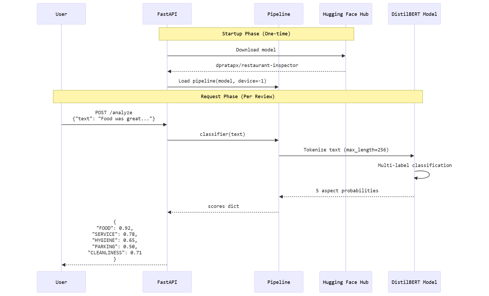
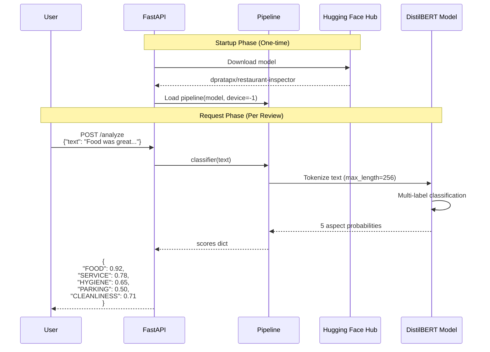

# Request Flow & Sequence

## Overview

This document describes the complete lifecycle of a restaurant review analysis request, from the moment a user submits text to receiving structured aspect scores.

## Flow Diagram





## Phase 1: Startup (One-Time Initialization)

### Step 1: Server Initialization
**When**: Container starts on HF Spaces  
**Duration**: ~30-60 seconds (first time), ~5 seconds (subsequent)

```python
# main.py - Executed at module import
app = FastAPI(
    title="Restaurant Inspector",
    description="AI-powered restaurant review aspect analyzer",
    version="1.0.0",
)
```

**Actions**:
- FastAPI application instance created
- Routes registered (`/`, `/health`, `/analyze`)
- Pydantic models loaded for validation

### Step 2: Model Download
**When**: `pipeline()` function called  
**Duration**: ~15-30 seconds (first time), cached thereafter

```python
classifier = pipeline(
    "text-classification",
    model="dpratapx/restaurant-inspector",
    device=-1,  # CPU mode
    top_k=None,  # Return all scores
)
```

**Actions**:
1. Connects to Hugging Face Hub API
2. Checks for cached model in `~/.cache/huggingface/`
3. Downloads if not cached:
   - `config.json` (1KB)
   - `model.safetensors` (255MB)
   - `tokenizer.json` (680KB)
   - `tokenizer_config.json` (1KB)
4. Validates model files integrity

**Network Request**:
```
GET https://huggingface.co/dpratapx/restaurant-inspector/resolve/main/config.json
GET https://huggingface.co/dpratapx/restaurant-inspector/resolve/main/model.safetensors
GET https://huggingface.co/dpratapx/restaurant-inspector/resolve/main/tokenizer.json
GET https://huggingface.co/dpratapx/restaurant-inspector/resolve/main/tokenizer_config.json
```

### Step 3: Model Loading
**When**: After download completes  
**Duration**: ~3-5 seconds

**Actions**:
1. Load model weights from safetensors
2. Initialize DistilBERT architecture (6 layers, 768 hidden size)
3. Load tokenizer vocabulary (30,522 tokens)
4. Move model to CPU (`device=-1`)
5. Set model to evaluation mode (`model.eval()`)

**Memory Usage**: ~800MB RAM

### Step 4: Server Ready
**When**: Pipeline fully loaded  
**Duration**: Immediate

**Console Output**:
```
🚀 Loading model...
✅ Model loaded successfully!
INFO:     Uvicorn running on http://0.0.0.0:7860 (Press CTRL+C to quit)
INFO:     Started reloader process [1] using StatReload
INFO:     Started server process [8]
INFO:     Waiting for application startup.
INFO:     Application startup complete.
```

**Actions**:
- Uvicorn web server starts listening on port 7860
- Health check endpoint becomes active
- Ready to accept inference requests

---

## Phase 2: Request Processing (Per Review)

### Step 1: User Submits Request
**Endpoint**: `POST /analyze`  
**Content-Type**: `application/json`

**Request Example**:
```json
{
  "text": "The food was absolutely delicious and the service was great! However, the parking area was too small and the bathroom was not very clean."
}
```

**cURL Command**:
```bash
curl -X POST https://dpratapx-restaurant-inspector-api-dev.hf.space/analyze \
  -H "Content-Type: application/json" \
  -d '{"text": "The food was delicious but parking was difficult!"}'
```

### Step 2: FastAPI Request Validation
**Duration**: ~1ms

**Actions**:
1. Parse JSON body
2. Validate against `ReviewRequest` Pydantic model:
   ```python
   class ReviewRequest(BaseModel):
       text: str = Field(..., min_length=1, max_length=5000)
   ```
3. Check field constraints:
   - `text` is required
   - Length between 1-5000 characters
4. Return 422 error if validation fails

**Validation Errors**:
- Missing `text` field → 422 Unprocessable Entity
- Empty string → 422 Unprocessable Entity
- Text > 5000 chars → 422 Unprocessable Entity

### Step 3: Call Classifier Pipeline
**Duration**: ~50-150ms (CPU)

**Code**:
```python
@app.post("/analyze", response_model=AnalysisResponse)
async def analyze_review(request: ReviewRequest):
    if classifier is None:
        raise HTTPException(status_code=503, detail="Model not loaded")
    
    # Run inference
    results = classifier(request.text)
```

**Actions**:
- Check model is loaded (null check)
- Pass text to pipeline
- Pipeline handles tokenization + inference internally

### Step 4: Tokenization
**Duration**: ~5-10ms  
**Component**: DistilBERT Tokenizer

**Process**:
1. **Text Normalization**:
   - Lowercase conversion
   - Unicode normalization (NFD)
   - Accent stripping

2. **Tokenization**:
   - WordPiece algorithm
   - Split on spaces and punctuation
   - Handle subwords (e.g., "delicious" → "delicious", "parking" → "park", "##ing")

3. **Special Tokens**:
   - Add `[CLS]` at start
   - Add `[SEP]` at end
   - Vocabulary size: 30,522 tokens

4. **Padding/Truncation**:
   - Max length: 256 tokens
   - Truncate if longer
   - Pad with `[PAD]` if shorter

5. **Convert to IDs**:
   - Map tokens to vocabulary indices
   - Create attention mask (1 for real tokens, 0 for padding)

**Example**:
```
Input: "The food was delicious"
Tokens: [CLS] the food was delicious [SEP]
IDs: [101, 1996, 2833, 2001, 11473, 102]
Attention Mask: [1, 1, 1, 1, 1, 1]
```

### Step 5: Model Inference
**Duration**: ~40-100ms (CPU)  
**Component**: DistilBERT Model

**Forward Pass**:
1. **Embedding Layer**:
   - Token embeddings (30,522 vocab → 768 dims)
   - Position embeddings (0-511 positions → 768 dims)
   - Sum embeddings

2. **Transformer Layers** (6 layers):
   - Multi-head self-attention (12 heads)
   - Feed-forward network (768 → 3072 → 768)
   - Layer normalization
   - Residual connections

3. **Classification Head**:
   - Extract `[CLS]` token representation (768 dims)
   - Dense layer: 768 → 5 (for 5 aspects)
   - Sigmoid activation (multi-label)

4. **Output**:
   - 5 probabilities (independent, not summing to 1)
   - Values between 0 and 1

**Computation**:
- Parameters: 67M
- FLOPs: ~22 billion
- Memory: ~800MB

### Step 6: Score Aggregation
**Duration**: ~1ms

**Actions**:
1. Extract raw model outputs:
   ```python
   # results = [{'label': 'LABEL_0', 'score': 0.92}, ...]
   ```

2. Map labels to aspect names:
   ```python
   ASPECT_NAMES = ["FOOD", "SERVICE", "HYGIENE", "PARKING", "CLEANLINESS"]
   scores = {
       ASPECT_NAMES[i]: result['score'] 
       for i, result in enumerate(results[0])
   }
   ```

3. Create response object:
   ```python
   return AnalysisResponse(
       review=request.text,
       scores=AspectScores(**scores),
       timestamp=datetime.utcnow().isoformat()
   )
   ```

### Step 7: JSON Response
**Duration**: ~1ms

**Response Schema**:
```json
{
  "review": "The food was delicious but parking was difficult!",
  "scores": {
    "FOOD": 0.92,
    "SERVICE": 0.65,
    "HYGIENE": 0.58,
    "PARKING": 0.23,
    "CLEANLINESS": 0.55
  },
  "timestamp": "2026-03-23T10:30:45.123456"
}
```

**HTTP Headers**:
```
HTTP/1.1 200 OK
content-type: application/json
content-length: 234
date: Sat, 23 Mar 2026 10:30:45 GMT
server: uvicorn
```

---

## Performance Metrics

### Latency Breakdown (Average)

| Phase | Duration | % of Total |
|-------|----------|------------|
| Request validation | 1ms | 1% |
| Tokenization | 8ms | 8% |
| Model inference | 85ms | 85% |
| Score aggregation | 1ms | 1% |
| Response formatting | 5ms | 5% |
| **Total** | **~100ms** | **100%** |

### Throughput

- **Single Request**: ~100ms
- **Concurrent Requests**: 5-10 req/sec (CPU-bound)
- **Daily Capacity**: ~430,000 requests (at 10 req/sec)

### Resource Usage

- **Memory**: 800MB (model) + 200MB (server) = ~1GB total
- **CPU**: 80-100% during inference
- **Disk**: 260MB (cached model)

---

## Error Handling

### Client Errors (4xx)

**422 Unprocessable Entity**:
```json
{
  "detail": [
    {
      "loc": ["body", "text"],
      "msg": "field required",
      "type": "value_error.missing"
    }
  ]
}
```

**Causes**:
- Missing `text` field
- Invalid JSON
- Text too long (>5000 chars)

### Server Errors (5xx)

**503 Service Unavailable**:
```json
{
  "detail": "Model not loaded. Please run 'python train.py' first."
}
```

**Causes**:
- Model failed to download
- Model file corrupted
- Out of memory during loading

---

## Optimization Opportunities

### Current Bottlenecks
1. **CPU Inference**: 85ms per request
2. **Serial Processing**: No batching
3. **Cold Start**: 30-60 seconds first time

### Potential Improvements
1. **GPU Inference**: 5-10x speedup (~10ms per request)
2. **Request Batching**: Process multiple reviews together
3. **Model Quantization**: INT8 quantization (2x speedup, 4x smaller)
4. **ONNX Runtime**: ~30% faster inference
5. **ONNX Runtime**: ~30% faster inference
6. **Caching**: Cache responses for duplicate reviews

---

## Health Check Flow

**Endpoint**: `GET /health`  
**Duration**: <1ms

**Request**:
```bash
curl https://dpratapx-restaurant-inspector-api-dev.hf.space/health
```

**Response**:
```json
{
  "status": "healthy",
  "model_loaded": true
}
```

**Logic**:
```python
@app.get("/health")
async def health_check():
    return {
        "status": "healthy",
        "model_loaded": classifier is not None
    }
```
