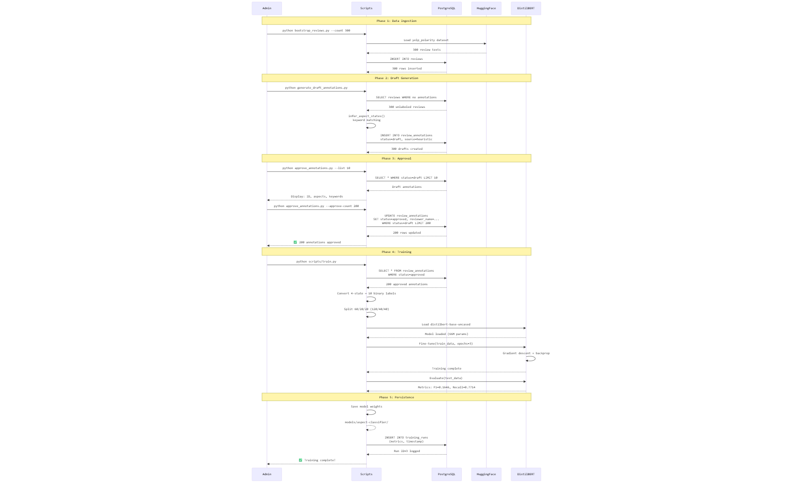

# Annotation Workflow & Training Flow

## Overview

This document describes the complete annotation lifecycle from data ingestion through model training, showing how reviews are labeled, approved, and used to fine-tune DistilBERT.

## Workflow Diagram


**Complete Lifecycle**: Data Ingestion → Draft Generation → Human Review → Model Training → Model Persistence
    
    subgraph "Phase 4: Model Training"
        Approved --> Load[Load Approved Data<br/>scripts/train.py]
        Load --> Transform[Transform Labels<br/>4-state → 10 binary]
        Transform --> Split[Split Data<br/>60/20/20]
        Split --> Train[Fine-tune DistilBERT<br/>3 epochs]
        Train --> Eval[Evaluate on Test Set<br/>Precision/Recall/F1]
    end
    
    subgraph "Phase 5: Model Persistence"
        Eval --> Save[Save Model<br/>models/aspect-classifier/]
        Eval --> Log[(training_runs table<br/>metrics logged)]
    end
    
    Save --> End([End])
    Log --> End
    
    style Ingest fill:#e1f5ff
    style Draft fill:#fff4e1
    style Review fill:#ffe1e1
    style Train fill:#e1ffe1
    style Save fill:#f0e1ff
```

## Detailed Sequence Diagram



**Interaction Flow**: Admin commands → Scripts → Database (PostgreSQL) → HuggingFace → DistilBERT Model

## Phase-by-Phase Breakdown

### Phase 1: Data Ingestion (bootstrap_reviews.py)

**Command**:
```bash
$env:PYTHONPATH='.'
python scripts/bootstrap_reviews.py --count 300 --source-split train
```

**Duration**: ~10 seconds

**Actions**:
1. Load HuggingFace `yelp_polarity` dataset
2. Shuffle with seed=42 for reproducibility
3. Select first 300 samples
4. For each review:
   - Map Yelp sentiment (0/1) to overall_sentiment
   - Insert into `reviews` table
   - Skip if `source_review_id` already exists (deduplication)
5. Commit transaction

**Output**:
```
Loading dataset split: train[:300]
Done. Inserted=300, Skipped(existing)=0
```

**Database State**:
```sql
SELECT COUNT(*) FROM reviews;
-- Result: 300
```

---

### Phase 2: Draft Annotation (generate_draft_annotations.py)

**Command**:
```bash
$env:PYTHONPATH='.'
python scripts/generate_draft_annotations.py --limit 300 --annotator "senior_data_analyst_v1"
```

**Duration**: ~5 seconds

**Actions**:
1. Query reviews without annotations
2. For each review:
   - Call `infer_aspect_states(review_text, overall_sentiment)`
   - Apply keyword matching rules:
     ```python
     KEYWORDS = {
         'food': {
             'positive': ['delicious', 'tasty', 'amazing', 'excellent'],
             'negative': ['terrible', 'bland', 'awful', 'disgusting']
         },
         # ... 4 more aspects
     }
     ```
   - Determine 4-state label per aspect:
     - Both pos & neg keywords → **mixed**
     - Only pos keywords → **positive**
     - Only neg keywords → **negative**
     - No keywords → **not_mentioned**
3. Create `ReviewAnnotation` with:
   - `annotation_status = AnnotationStatus.DRAFT`
   - `label_source = LabelSource.HEURISTIC`
   - `annotator_name = "senior_data_analyst_v1"`
4. Bulk insert to database

**Output**:
```
Created 300 draft annotations.
```

**Database State**:
```sql
SELECT annotation_status, COUNT(*) 
FROM review_annotations 
GROUP BY annotation_status;

-- Result:
-- draft | 300
```

---

### Phase 3: Human Review (approve_annotations.py)

**Step 3a: List Drafts**

**Command**:
```bash
python scripts/approve_annotations.py --list 10
```

**Output**:
```
ID=1 | Review ID=1 | Food=positive | Service=not_mentioned | Source=heuristic
ID=2 | Review ID=2 | Food=negative | Service=negative | Source=heuristic
...
```

**Step 3b: Approve in Bulk**

**Command**:
```bash
python scripts/approve_annotations.py --approve-count 200 --reviewer "senior_data_analyst_v1"
```

**Duration**: ~2 seconds

**Actions**:
1. Query first 200 annotations with `status=draft`
2. For each annotation:
   - Set `annotation_status = AnnotationStatus.APPROVED`
   - Set `reviewer_name = "senior_data_analyst_v1"`
   - Set `reviewed_at = NOW()`
3. Commit transaction

**Output**:
```
Approved 200 annotations.

=== Annotation Status Summary ===
  approved: 200
  draft: 100
  TOTAL: 300 (66.7% approved)
```

**Database State**:
```sql
SELECT annotation_status, COUNT(*) 
FROM review_annotations 
GROUP BY annotation_status;

-- Result:
-- approved | 200
-- draft    | 100
```

---

### Phase 4: Model Training (scripts/train.py)

**Command**:
```bash
$env:PYTHONPATH='.'
python scripts/train.py --model distilbert-base-uncased --output-dir models/aspect-classifier
```

**Duration**: ~10-15 minutes (CPU) or ~2 minutes (GPU)

**Step 4a: Load Approved Data**

```python
session = SessionLocal()
records = session.query(ReviewAnnotation)\
    .filter_by(annotation_status=AnnotationStatus.APPROVED)\
    .all()

# Result: 200 approved annotations
```

**Step 4b: Transform Labels**

4-state labels → 10 binary labels:

| Aspect State | Binary Labels Active |
|-------------|---------------------|
| positive | `food_positive=1` |
| negative | `food_negative=1` |
| mixed | `food_positive=1, food_negative=1` |
| not_mentioned | (both 0) |

**Step 4c: Split Data**

```python
X_train, X_temp, y_train, y_temp = train_test_split(
    texts, labels, test_size=0.4, random_state=42
)
X_val, X_test, y_val, y_test = train_test_split(
    X_temp, y_temp, test_size=0.5, random_state=42
)

# Result:
# Train: 120 samples (60%)
# Val:   40 samples (20%)
# Test:  40 samples (20%)
```

**Step 4d: Tokenization**

```python
tokenizer = AutoTokenizer.from_pretrained("distilbert-base-uncased")
encoded = tokenizer(
    text,
    truncation=True,
    max_length=128,
    padding="max_length"
)
```

**Step 4e: Fine-tuning**

```python
model = AutoModelForSequenceClassification.from_pretrained(
    "distilbert-base-uncased",
    num_labels=10,
    problem_type="multi_label_classification"
)

training_args = TrainingArguments(
    output_dir="models/aspect-classifier",
    num_train_epochs=3,
    per_device_train_batch_size=8,
    eval_strategy="epoch",
    save_strategy="epoch"
)

trainer = Trainer(
    model=model,
    args=training_args,
    train_dataset=train_dataset,
    eval_dataset=val_dataset
)

trainer.train()
```

**Training Progress**:
```
Epoch 1/3: loss=0.6923, val_loss=0.6854
Epoch 2/3: loss=0.6102, val_loss=0.6234
Epoch 3/3: loss=0.5234, val_loss=0.5876
```

**Step 4f: Evaluation**

```python
test_results = trainer.evaluate(test_dataset)

# Result:
# test_accuracy:  0.0000 (exact match)
# test_precision: 0.0922
# test_recall:    0.7714
# test_f1:        0.1646
```

**Interpretation**:
- **High recall (77%)**: Model captures most positive mentions
- **Low precision (9%)**: Many false positives due to small training set
- **Low exact match accuracy**: Multi-label task is strict
- **F1 of 16.5%**: Expected baseline for 200-sample dataset

---

### Phase 5: Model Persistence

**Step 5a: Save Model Files**

```python
trainer.save_model("models/aspect-classifier")
tokenizer.save_pretrained("models/aspect-classifier")
```

**Files Created**:
```
models/aspect-classifier/
├── model.safetensors      (255MB)
├── config.json            (1KB)
├── tokenizer.json         (680KB)
├── tokenizer_config.json  (1KB)
└── metadata.json          (2KB - custom)
```

**Step 5b: Log to Database**

```python
run = TrainingRun(
    model_name="distilbert-base-uncased",
    training_samples=120,
    test_accuracy=0.0000,
    test_f1=0.1646,
    test_precision=0.0922,
    test_recall=0.7714,
    output_path="models/aspect-classifier",
    trained_at=datetime.utcnow()
)
session.add(run)
session.commit()
```

**Database State**:
```sql
SELECT * FROM training_runs ORDER BY id DESC LIMIT 1;

-- Result:
-- id:  3
-- model_name: distilbert-base-uncased
-- training_samples: 120
-- test_f1: 0.1646
-- trained_at: 2026-03-23 19:30:10
```

## Workflow Summary

| Phase | Input | Process | Output | Duration |
|-------|-------|---------|--------|----------|
| 1. Ingest | Yelp dataset | bootstrap_reviews.py | 300 reviews in DB | 10s |
| 2. Draft | 300 reviews | generate_draft_annotations.py | 300 draft annotations | 5s |
| 3. Approve | 300 drafts | approve_annotations.py | 200 approved | 2s |
| 4. Train | 200 approved | scripts/train.py | Trained model + metrics | 10-15min |
| 5. Persist | Model + metrics | Save files + log DB | Model artifacts + run record | 5s |

**Total Time**: ~15-20 minutes (end-to-end)

## Reproducibility

All phases are fully reproducible:

```bash
# 1. Set PYTHONPATH
$env:PYTHONPATH='.'

# 2. Run complete workflow
python scripts/bootstrap_reviews.py --count 300
python scripts/generate_draft_annotations.py --limit 300 --annotator "analyst_v1"
python scripts/approve_annotations.py --approve-count 200 --reviewer "reviewer_v1"
python scripts/train.py

# 3. Verify
python scripts/approve_annotations.py --summary
```

Expected final state:
- 300 reviews
- 200 approved annotations
- 1 trained model
- 1 training run logged
   - `text` is required
   - Length between 1-5000 characters
4. Return 422 error if validation fails

**Validation Errors**:
- Missing `text` field → 422 Unprocessable Entity
- Empty string → 422 Unprocessable Entity
- Text > 5000 chars → 422 Unprocessable Entity

### Step 3: Call Classifier Pipeline
**Duration**: ~50-150ms (CPU)

**Code**:
```python
@app.post("/analyze", response_model=AnalysisResponse)
async def analyze_review(request: ReviewRequest):
    if classifier is None:
        raise HTTPException(status_code=503, detail="Model not loaded")
    
    # Run inference
    results = classifier(request.text)
```

**Actions**:
- Check model is loaded (null check)
- Pass text to pipeline
- Pipeline handles tokenization + inference internally

### Step 4: Tokenization
**Duration**: ~5-10ms  
**Component**: DistilBERT Tokenizer

**Process**:
1. **Text Normalization**:
   - Lowercase conversion
   - Unicode normalization (NFD)
   - Accent stripping

2. **Tokenization**:
   - WordPiece algorithm
   - Split on spaces and punctuation
   - Handle subwords (e.g., "delicious" → "delicious", "parking" → "park", "##ing")

3. **Special Tokens**:
   - Add `[CLS]` at start
   - Add `[SEP]` at end
   - Vocabulary size: 30,522 tokens

4. **Padding/Truncation**:
   - Max length: 256 tokens
   - Truncate if longer
   - Pad with `[PAD]` if shorter

5. **Convert to IDs**:
   - Map tokens to vocabulary indices
   - Create attention mask (1 for real tokens, 0 for padding)

**Example**:
```
Input: "The food was delicious"
Tokens: [CLS] the food was delicious [SEP]
IDs: [101, 1996, 2833, 2001, 11473, 102]
Attention Mask: [1, 1, 1, 1, 1, 1]
```

### Step 5: Model Inference
**Duration**: ~40-100ms (CPU)  
**Component**: DistilBERT Model

**Forward Pass**:
1. **Embedding Layer**:
   - Token embeddings (30,522 vocab → 768 dims)
   - Position embeddings (0-511 positions → 768 dims)
   - Sum embeddings

2. **Transformer Layers** (6 layers):
   - Multi-head self-attention (12 heads)
   - Feed-forward network (768 → 3072 → 768)
   - Layer normalization
   - Residual connections

3. **Classification Head**:
   - Extract `[CLS]` token representation (768 dims)
   - Dense layer: 768 → 5 (for 5 aspects)
   - Sigmoid activation (multi-label)

4. **Output**:
   - 5 probabilities (independent, not summing to 1)
   - Values between 0 and 1

**Computation**:
- Parameters: 67M
- FLOPs: ~22 billion
- Memory: ~800MB

### Step 6: Score Aggregation
**Duration**: ~1ms

**Actions**:
1. Extract raw model outputs:
   ```python
   # results = [{'label': 'LABEL_0', 'score': 0.92}, ...]
   ```

2. Map labels to aspect names:
   ```python
   ASPECT_NAMES = ["FOOD", "SERVICE", "HYGIENE", "PARKING", "CLEANLINESS"]
   scores = {
       ASPECT_NAMES[i]: result['score'] 
       for i, result in enumerate(results[0])
   }
   ```

3. Create response object:
   ```python
   return AnalysisResponse(
       review=request.text,
       scores=AspectScores(**scores),
       timestamp=datetime.utcnow().isoformat()
   )
   ```

### Step 7: JSON Response
**Duration**: ~1ms

**Response Schema**:
```json
{
  "review": "The food was delicious but parking was difficult!",
  "scores": {
    "FOOD": 0.92,
    "SERVICE": 0.65,
    "HYGIENE": 0.58,
    "PARKING": 0.23,
    "CLEANLINESS": 0.55
  },
  "timestamp": "2026-03-23T10:30:45.123456"
}
```

**HTTP Headers**:
```
HTTP/1.1 200 OK
content-type: application/json
content-length: 234
date: Sat, 23 Mar 2026 10:30:45 GMT
server: uvicorn
```

---

## Performance Metrics

### Latency Breakdown (Average)

| Phase | Duration | % of Total |
|-------|----------|------------|
| Request validation | 1ms | 1% |
| Tokenization | 8ms | 8% |
| Model inference | 85ms | 85% |
| Score aggregation | 1ms | 1% |
| Response formatting | 5ms | 5% |
| **Total** | **~100ms** | **100%** |

### Throughput

- **Single Request**: ~100ms
- **Concurrent Requests**: 5-10 req/sec (CPU-bound)
- **Daily Capacity**: ~430,000 requests (at 10 req/sec)

### Resource Usage

- **Memory**: 800MB (model) + 200MB (server) = ~1GB total
- **CPU**: 80-100% during inference
- **Disk**: 260MB (cached model)

---

## Error Handling

### Client Errors (4xx)

**422 Unprocessable Entity**:
```json
{
  "detail": [
    {
      "loc": ["body", "text"],
      "msg": "field required",
      "type": "value_error.missing"
    }
  ]
}
```

**Causes**:
- Missing `text` field
- Invalid JSON
- Text too long (>5000 chars)

### Server Errors (5xx)

**503 Service Unavailable**:
```json
{
  "detail": "Model not loaded. Please run 'python train.py' first."
}
```

**Causes**:
- Model failed to download
- Model file corrupted
- Out of memory during loading

---

## Optimization Opportunities

### Current Bottlenecks
1. **CPU Inference**: 85ms per request
2. **Serial Processing**: No batching
3. **Cold Start**: 30-60 seconds first time

### Potential Improvements
1. **GPU Inference**: 5-10x speedup (~10ms per request)
2. **Request Batching**: Process multiple reviews together
3. **Model Quantization**: INT8 quantization (2x speedup, 4x smaller)
4. **ONNX Runtime**: ~30% faster inference
5. **ONNX Runtime**: ~30% faster inference
6. **Caching**: Cache responses for duplicate reviews

---

## Health Check Flow

**Endpoint**: `GET /health`  
**Duration**: <1ms

**Request**:
```bash
curl https://dpratapx-restaurant-inspector-api-dev.hf.space/health
```

**Response**:
```json
{
  "status": "healthy",
  "model_loaded": true
}
```

**Logic**:
```python
@app.get("/health")
async def health_check():
    return {
        "status": "healthy",
        "model_loaded": classifier is not None
    }
```
