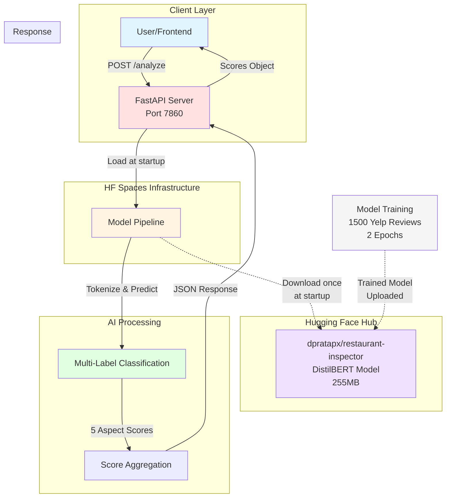
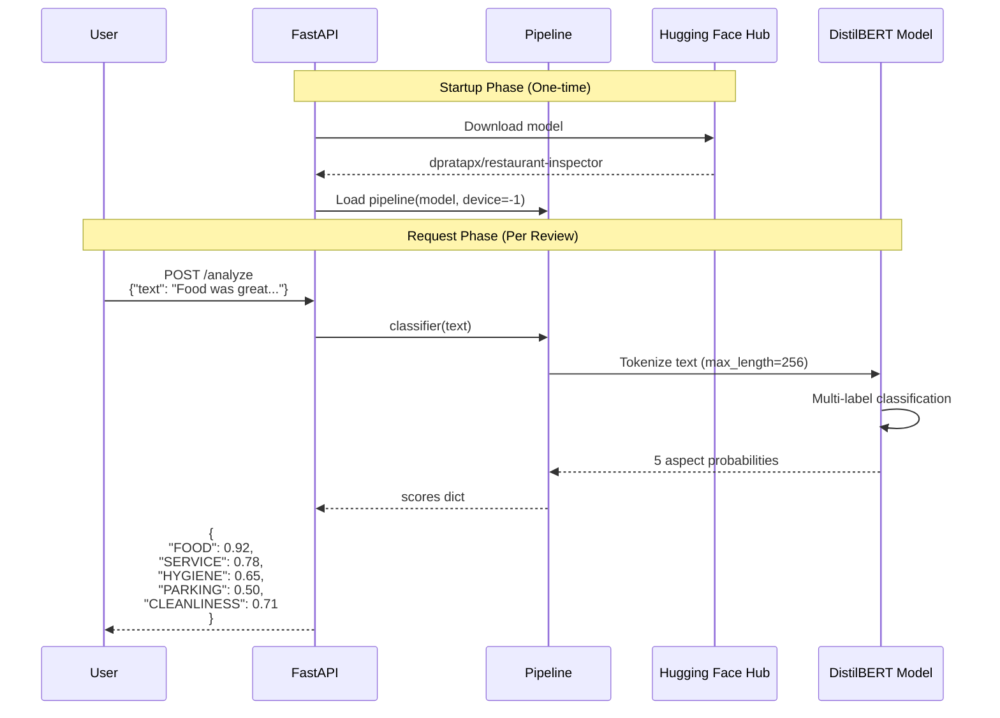
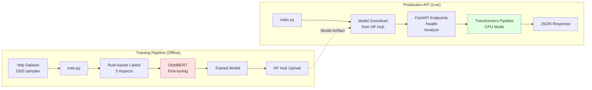

# Mermaid Diagram Syntax

This file contains the Mermaid syntax for all architecture diagrams.

## Architecture Diagram

```mermaid
graph TB
    subgraph "Client Layer"
        A[User/Frontend] -->|POST /analyze| B[FastAPI Server]
    end
    
    subgraph "HF Spaces Infrastructure"
        B[FastAPI Server<br/>Port 7860]
        B -->|Load at startup| C[Model Pipeline]
    end
    
    subgraph "Hugging Face Hub"
        D[dpratapx/restaurant-inspector<br/>DistilBERT Model<br/>255MB]
    end
    
    subgraph "AI Processing"
        C -->|Tokenize & Predict| E[Multi-Label Classification]
        E -->|5 Aspect Scores| F[Score Aggregation]
    end
    
    subgraph "Response"
        F -->|JSON Response| B
        B -->|Scores Object| A
    end
    
    C -.->|Download once<br/>at startup| D
    
    G[Model Training<br/>1500 Yelp Reviews<br/>2 Epochs] -.->|Trained Model<br/>Uploaded| D
    
    style A fill:#e1f5ff
    style B fill:#ffe1e1
    style C fill:#fff4e1
    style E fill:#e1ffe1
    style D fill:#f0e1ff
    style G fill:#f5f5f5
    
    classDef highlight fill:#ffeb3b,stroke:#333,stroke-width:2px
```

## Flow Diagram

```mermaid
sequenceDiagram
    participant User
    participant FastAPI
    participant Pipeline
    participant HFHub as Hugging Face Hub
    participant Model as DistilBERT Model
    
    Note over FastAPI,HFHub: Startup Phase (One-time)
    FastAPI->>HFHub: Download model
    HFHub-->>FastAPI: dpratapx/restaurant-inspector
    FastAPI->>Pipeline: Load pipeline(model, device=-1)
    
    Note over User,Model: Request Phase (Per Review)
    User->>FastAPI: POST /analyze<br/>{"text": "Food was great..."}
    FastAPI->>Pipeline: classifier(text)
    Pipeline->>Model: Tokenize text (max_length=256)
    Model->>Model: Multi-label classification
    Model-->>Pipeline: 5 aspect probabilities
    Pipeline-->>FastAPI: scores dict
    FastAPI-->>User: {<br/>"FOOD": 0.92,<br/>"SERVICE": 0.78,<br/>"HYGIENE": 0.65,<br/>"PARKING": 0.50,<br/>"CLEANLINESS": 0.71<br/>}
```

## System Components Diagram

```mermaid
graph LR
    subgraph "Training Pipeline (Offline)"
        T1[Yelp Dataset<br/>1500 samples] --> T2[train.py]
        T2 --> T3[Rule-based Labels<br/>5 Aspects]
        T3 --> T4[DistilBERT<br/>Fine-tuning]
        T4 --> T5[Trained Model]
        T5 --> T6[HF Hub Upload]
    end
    
    subgraph "Production API (Live)"
        P1[main.py] --> P2[Model Download<br/>from HF Hub]
        P2 --> P3[FastAPI Endpoints<br/>/health<br/>/analyze]
        P3 --> P4[Transformers Pipeline<br/>CPU Mode]
        P4 --> P5[JSON Response]
    end
    
    T6 -.->|Model Artifact| P2
    
    style T4 fill:#ffe1e1
    style P4 fill:#e1ffe1
```
