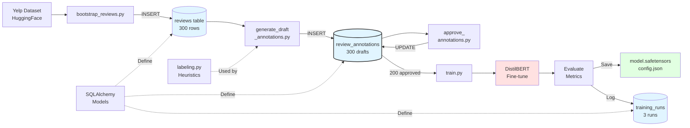
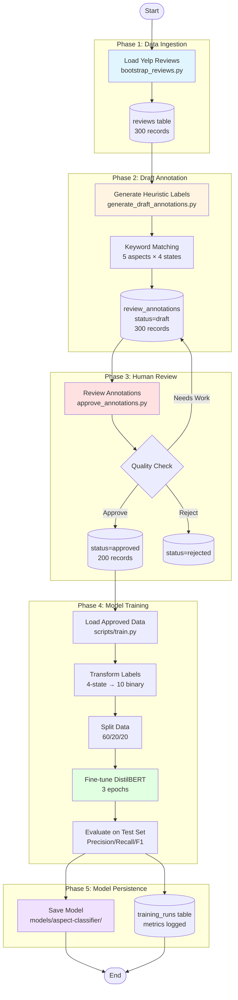
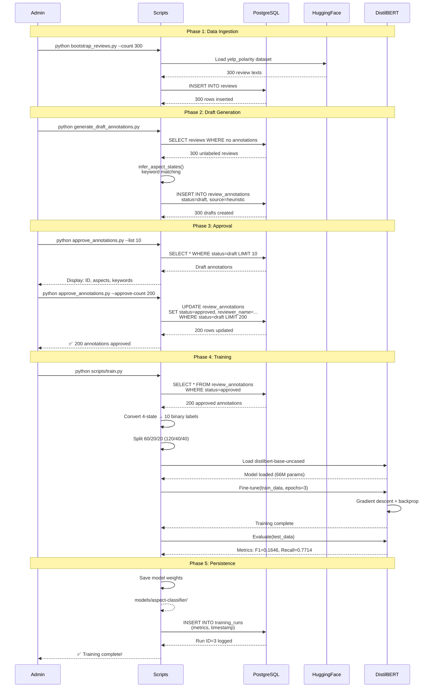
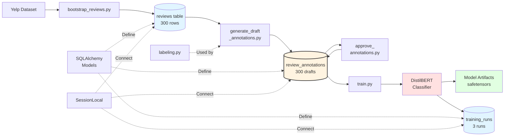
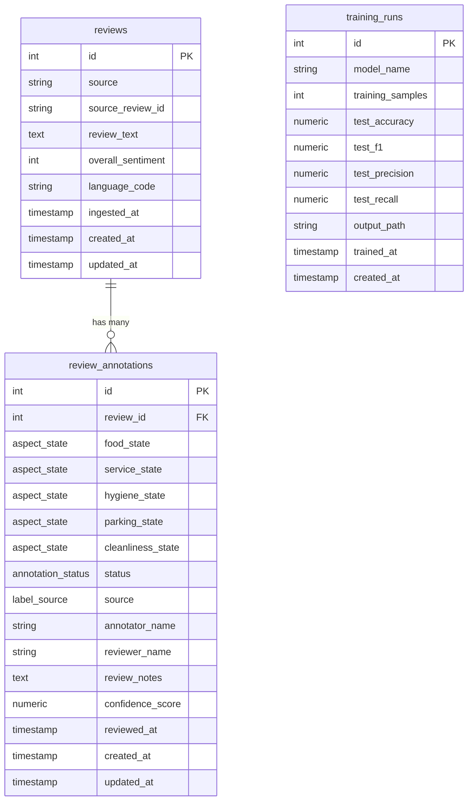
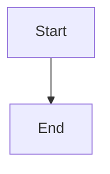

# Mermaid Diagram Syntax Reference

This file contains the Mermaid syntax for all Restaurant Inspector architecture diagrams.

**Last Updated**: March 24, 2026  
**System**: Database-backed annotation workflow with PostgreSQL + DistilBERT

---

## Architecture Diagram

Database-backed annotation workflow showing PostgreSQL, scripts, ORM, and training pipeline.
**Layout**: Horizontal (left-to-right) for better visibility in one view.



---

## Annotation Workflow Diagram

Complete annotation lifecycle from ingestion to model training.



---

## Sequence Diagram - Annotation Pipeline

Detailed sequence showing database interactions during annotation workflow.



---

## System Components Diagram

Component-level view with database at the center.



---

## Database Schema ER Diagram

Entity-relationship diagram showing table relationships.



---

## Usage Examples

### Rendering Diagrams

**In Markdown files** (GitHub, GitLab, VS Code with Mermaid extension):
````markdown

````

**In live documentation** (MkDocs, Docusaurus, etc.):
- Install mermaid plugin
- Use same syntax as above

**Online editors**:
- https://mermaid.live/ - Official live editor
- https://mermaid.ink/ - Generate PNG/SVG images

### Customization

**Color Schemes**:
```mermaid
style NodeName fill:#color,stroke:#color,stroke-width:2px
```

Common colors:
- Blue: `#e1f5ff` - Database/storage
- Red: `#ffe1e1` - Processing/computation
- Green: `#e1ffe1` - Output/results
- Yellow: `#fff4e1` - Key focus areas
- Purple: `#f0e1ff` - External services

**Node Shapes**:
- `[Text]` - Rectangle
- `(Text)` - Rounded rectangle
- `([Text])` - Stadium
- `[[Text]]` - Subroutine
- `[(Text)]` - Cylinder (database)
- `{Text}` - Diamond (decision)

**Line Types**:
- `-->` - Solid arrow
- `-.->` - Dotted arrow
- `==>` - Thick arrow
- `---` - Solid line (no arrow)

---

## Diagram Maintenance

**When to update**:
- Schema changes (new tables, columns)
- New scripts or components added
- Workflow changes (approval process, etc.)
- Migration updates

**How to update**:
1. Edit this file with new Mermaid syntax
2. Copy updated diagram to relevant .md file in `/docs`
3. Test rendering in VS Code or mermaid.live
4. Commit changes with descriptive message

**Version Control**:
- All diagrams versioned in Git
- Track changes alongside code
- Reference commit hash in architecture docs
