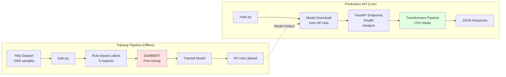

# System Components

## Overview

The Restaurant Inspector system consists of two primary pipelines: the **Training Pipeline** (offline) and the **Production API** (live). This document details each component's role, implementation, and interactions.

## Components Diagram




---

## Training Pipeline (Offline)

The training pipeline is executed once locally to create and upload the model. It does NOT run in production.

### Component T1: Yelp Dataset

**Purpose**: Source of training data for restaurant reviews

**Specification**:
- **Name**: `yelp_polarity` from Hugging Face Datasets
- **Total Size**: 560,000 reviews
- **Used**: 1,500 samples (for quick training)
- **Split**: train/test
- **Labels**: Binary sentiment (positive/negative)

**Data Schema**:
```python
{
    'text': str,  # Review text
    'label': int  # 0 (negative) or 1 (positive)
}
```

**Example**:
```json
{
  "text": "The food was incredible, best pizza I've ever had!",
  "label": 1
}
```

**Loading Code** (`train.py`):
```python
from datasets import load_dataset

dataset = load_dataset("yelp_polarity", split="train", trust_remote_code=False)
dataset = dataset.shuffle(seed=42).select(range(1500))
```

**Statistics**:
- Average review length: ~150 words
- Positive/Negative ratio: 50/50
- Language: English only

---

### Component T2: train.py

**Purpose**: Main training script that orchestrates the entire training process

**File**: `train.py` (285 lines)

**Key Functions**:

1. **`label_aspects(text, label)`**:
   - Converts binary Yelp labels into 5-aspect scores
   - Uses keyword matching for aspect detection
   - Returns list of 5 floats [FOOD, SERVICE, HYGIENE, PARKING, CLEANLINESS]

2. **`main()`**:
   - Loads dataset
   - Creates aspect labels
   - Tokenizes text
   - Fine-tunes model
   - Saves to disk
   - Uploads to HF Hub (optional)

**Execution**:
```bash
python train.py
```

**Duration**: ~45 minutes on CPU

**Dependencies**:
- transformers==5.3.0
- datasets==4.8.3
- torch==2.10.0
- accelerate (for Trainer)

---

### Component T3: Rule-based Labels

**Purpose**: Generate multi-label annotations from binary sentiment labels

**Implementation**: Keyword-based aspect extraction

**Keywords by Aspect**:

```python
ASPECT_KEYWORDS = {
    'FOOD': ['delicious', 'tasty', 'flavor', 'meal', 'dish', 'food', 
             'taste', 'yummy', 'terrible', 'bland'],
    
    'SERVICE': ['service', 'waiter', 'staff', 'server', 'attentive', 
                'friendly', 'rude', 'slow service'],
    
    'HYGIENE': ['dirty', 'clean', 'sanitary', 'unhygienic', 'bacteria', 
                'health code', 'filthy'],
    
    'PARKING': ['parking', 'park', 'parking lot', 'parking space', 
                'valet', 'no parking'],
    
    'CLEANLINESS': ['clean', 'spotless', 'tidy', 'organized', 'messy', 
                     'cluttered', 'bathroom clean']
}
```

**Labeling Logic**:
```python
def label_aspects(text, label):
    """Create multi-label annotations."""
    scores = [0.5, 0.5, 0.5, 0.5, 0.5]  # Default neutral
    text_lower = text.lower()
    
    for i, (aspect, keywords) in enumerate(ASPECT_KEYWORDS.items()):
        for keyword in keywords:
            if keyword in text_lower:
                # Positive review → high score, negative → low score
                scores[i] = 0.9 if label == 1 else 0.1
                break
    
    return scores
```

**Example Transformation**:
```
Input:
  Text: "The food was amazing but service was terrible"
  Label: 0 (negative overall)

Output:
  [0.9, 0.1, 0.5, 0.5, 0.5]  # FOOD high, SERVICE low, others neutral
```

**Limitations**:
- Simplistic keyword matching
- No context understanding
- No negation handling ("not delicious" counted as positive)
- Future: Use ChatGPT/Claude for better labeling

---

### Component T4: DistilBERT Fine-tuning

**Purpose**: Adapt pretrained DistilBERT to restaurant aspect classification

**Base Model**: `distilbert-base-uncased`
- Parameters: 66M
- Layers: 6 transformer blocks
- Hidden size: 768
- Attention heads: 12
- Vocabulary: 30,522 tokens

**Fine-tuning Configuration**:

```python
from transformers import TrainingArguments, Trainer

training_args = TrainingArguments(
    output_dir="./model",
    num_train_epochs=2,
    per_device_train_batch_size=8,
    learning_rate=5e-5,
    warmup_steps=50,
    logging_steps=10,
    save_strategy="epoch",
    evaluation_strategy="no",
)

trainer = Trainer(
    model=model,
    args=training_args,
    train_dataset=tokenized_dataset,
)

trainer.train()
```

**Training Steps**:
1. Load pretrained DistilBERT weights
2. Replace classification head (768 → 5 outputs)
3. Freeze nothing (full fine-tuning)
4. Train for 2 epochs
5. Use AdamW optimizer (lr=5e-5)
6. Apply linear warmup (50 steps)

**Training Metrics**:
- Total steps: 376 (1500 samples / 8 batch size × 2 epochs)
- Training loss: 0.35 (final)
- Time: ~45 minutes on CPU
- GPU: Would take ~5 minutes on T4

**Model Architecture Changes**:
```
Before:
  DistilBERT → [768] → Classifier(2) → Binary sentiment

After:
  DistilBERT → [768] → Classifier(5) → Multi-label aspects
                        ↓
                    Sigmoid activation (independent probabilities)
```

---

### Component T5: Trained Model

**Purpose**: Serialized model artifact ready for deployment

**Output Files**:
```
./model/
├── config.json              # Model configuration
├── model.safetensors        # Model weights (255MB)
├── tokenizer.json          # Tokenizer vocabulary (680KB)
└── tokenizer_config.json   # Tokenizer settings
```

**config.json** (excerpt):
```json
{
  "model_type": "distilbert",
  "num_labels": 5,
  "hidden_size": 768,
  "num_attention_heads": 12,
  "num_hidden_layers": 6,
  "vocab_size": 30522,
  "max_position_embeddings": 512
}
```

**Model Size**:
- Total: 255MB
- Embeddings: 93MB (30522 × 768 × 4 bytes)
- Transformer layers: 150MB
- Classification head: 15KB (768 × 5 × 4 bytes)

**Format**: SafeTensors (recommended over pickle for security)

---

### Component T6: HF Hub Upload

**Purpose**: Deploy model to public repository for production access

**Script**: `upload_model.py`

```python
from huggingface_hub import HfApi, login
import os

# Login
token = os.getenv("HF_TOKEN")
login(token=token)

# Upload
api = HfApi()
api.create_repo("dpratapx/restaurant-inspector", repo_type="model", exist_ok=True)
api.upload_folder(
    folder_path="./model",
    repo_id="dpratapx/restaurant-inspector",
    repo_type="model",
)
```

**Repository**: https://huggingface.co/dpratapx/restaurant-inspector

**Benefits**:
- Version control (Git LFS for large files)
- CDN for fast worldwide downloads
- Model card for documentation
- Free hosting for public models
- Integration with Transformers library

---

## Production API (Live)

The production API runs continuously on HF Spaces, serving inference requests.

### Component P1: main.py

**Purpose**: FastAPI application entry point

**File**: `main.py` (120 lines)

**Structure**:
```python
# Imports
from fastapi import FastAPI, HTTPException
from pydantic import BaseModel, Field
from transformers import pipeline
from datetime import datetime

# App initialization
app = FastAPI(
    title="Restaurant Inspector",
    description="AI-powered restaurant review aspect analyzer",
    version="1.0.0",
)

# Pydantic models
class ReviewRequest(BaseModel):
    text: str = Field(..., min_length=1, max_length=5000)

class AspectScores(BaseModel):
    FOOD: float
    SERVICE: float
    HYGIENE: float
    PARKING: float
    CLEANLINESS: float

class AnalysisResponse(BaseModel):
    review: str
    scores: AspectScores
    timestamp: str

# Model loading (at startup)
classifier = pipeline(
    "text-classification",
    model="dpratapx/restaurant-inspector",
    device=-1,
    top_k=None,
)

# Endpoints
@app.get("/")
async def root():
    return {"message": "Restaurant Inspector API", "status": "running"}

@app.get("/health")
async def health_check():
    return {"status": "healthy", "model_loaded": classifier is not None}

@app.post("/analyze", response_model=AnalysisResponse)
async def analyze_review(request: ReviewRequest):
    results = classifier(request.text)
    scores = {ASPECT_NAMES[i]: r['score'] for i, r in enumerate(results[0])}
    return AnalysisResponse(
        review=request.text,
        scores=AspectScores(**scores),
        timestamp=datetime.utcnow().isoformat()
    )
```

**Features**:
- CORS enabled (all origins)
- Auto-generated docs (`/docs`, `/redoc`)
- Input validation
- Error handling
- Type safety

---

### Component P2: Model Download

**Purpose**: Fetch trained model from HF Hub at startup

**Mechanism**:
- Triggered by `pipeline()` call
- Uses `transformers` library auto-download
- Caches in `~/.cache/huggingface/`
- Resumes interrupted downloads

**Download Process**:
1. Check cache: `~/.cache/huggingface/hub/models--dpratapx--restaurant-inspector`
2. If missing, fetch from CDN:
   ```
   https://cdn-lfs.huggingface.co/dpratapx/restaurant-inspector/...
   ```
3. Verify file hashes (SHA256)
4. Store locally for future use

**Cache Behavior**:
- First startup: Downloads all files (~260MB)
- Subsequent startups: Uses cached files (instant)
- Cache persists across container restarts (HF Spaces)

---

### Component P3: FastAPI Endpoints

**Purpose**: HTTP interface for client interactions

**Endpoints**:

1. **`GET /`** - Root/welcome
   - Returns API info
   - Used for basic connectivity test

2. **`GET /health`** - Health check
   - Returns server status
   - Checks model loaded
   - Used for monitoring/liveness probes

3. **`POST /analyze`** - Main inference endpoint
   - Accepts review text
   - Returns aspect scores
   - Validates input
   - Handles errors

4. **`GET /docs`** - Interactive API docs (auto-generated)
   - Swagger UI
   - Try endpoints directly
   - See request/response schemas

5. **`GET /redoc`** - Alternative docs (auto-generated)
   - ReDoc UI
   - Better for reading
   - Same info as `/docs`

**OpenAPI Spec**: Auto-generated at `/openapi.json`

---

### Component P4: Transformers Pipeline

**Purpose**: Abstraction layer for model inference

**Class**: `transformers.pipeline("text-classification")`

**Configuration**:
```python
classifier = pipeline(
    "text-classification",
    model="dpratapx/restaurant-inspector",
    device=-1,         # CPU mode
    top_k=None,        # Return all 5 scores
    return_all_scores=True,
)
```

**Internal Components**:
1. **Tokenizer**: Converts text → token IDs
2. **Model**: Runs inference
3. **Post-processor**: Formats outputs

**Usage**:
```python
results = classifier("The food was great")
# Returns: [{'label': 'LABEL_0', 'score': 0.92}, ...]
```

**Benefits**:
- Handles tokenization automatically
- Manages model device placement
- Batching support (if needed)
- Error handling
- Consistent interface

---

### Component P5: JSON Response

**Purpose**: Serialize predictions into standard API response

**Format** (`AnalysisResponse`):
```json
{
  "review": "Original review text",
  "scores": {
    "FOOD": 0.92,
    "SERVICE": 0.78,
    "HYGIENE": 0.65,
    "PARKING": 0.50,
    "CLEANLINESS": 0.71
  },
  "timestamp": "2026-03-23T10:30:45.123456"
}
```

**Fields**:
- `review`: Echo back input text (for client verification)
- `scores`: Object with 5 aspect scores (0-1 range)
- `timestamp`: ISO 8601 UTC timestamp

**Content-Type**: `application/json`

**Status Codes**:
- 200: Success
- 422: Validation error
- 503: Model not loaded

---

## Component Interactions

### Training → Production Flow

```
1. Developer runs train.py locally
2. Model trained on Yelp data with rule-based labels
3. Model saved to ./model/ directory
4. upload_model.py pushes to HF Hub
5. HF Hub stores model with version control
6. Production API downloads from HF Hub at startup
7. Cached locally for future requests
```

### Request → Response Flow

```
1. Client sends POST /analyze with review text
2. FastAPI validates request (Pydantic)
3. Text passed to Transformers pipeline
4. Pipeline tokenizes text
5. Model runs inference (CPU)
6. Pipeline formats outputs
7. FastAPI creates JSON response
8. Client receives aspect scores
```

---

## Technology Stack

### Training
- **Language**: Python 3.11
- **Framework**: PyTorch 2.10
- **ML Library**: Transformers 5.3
- **Data**: Datasets 4.8
- **Training**: Accelerate (for Trainer)

### Production
- **Runtime**: Docker (Python 3.11-slim)
- **Web Framework**: FastAPI 0.135
- **Server**: Uvicorn 0.42
- **ML Inference**: Transformers 5.3
- **Validation**: Pydantic 2.12
- **Platform**: HF Spaces (Docker SDK)

### Infrastructure
- **Model Storage**: Hugging Face Hub
- **Code Storage**: GitHub
- **Deployment**: Hugging Face Spaces
- **CDN**: HF Hub CDN (worldwide)

---

## File Structure

```
resturant-inspector-server/
├── main.py                 # Production API (P1, P3, P4, P5)
├── train.py                # Training script (T2, T3, T4)
├── upload_model.py         # Model upload (T6)
├── pyproject.toml          # Dependencies
├── Dockerfile              # HF Spaces deployment
├── README.md               # HF Spaces card
├── .env                    # Local secrets
├── .gitignore              # Git exclusions
├── docs/
│   ├── architecture.md
│   ├── flow.md
│   ├── system-components.md
│   └── mermaid-syntax.md
└── model/                  # Local model cache (T5)
    ├── config.json
    ├── model.safetensors
    ├── tokenizer.json
    └── tokenizer_config.json
```

---

## Deployment

### Local Development
```bash
# Train model
python train.py

# Upload to HF Hub
python upload_model.py

# Run API locally
uvicorn main:app --reload --port 8000
```

### Production (HF Spaces)
```bash
# Push code to HF Space
git remote add hf https://huggingface.co/spaces/dpratapx/restaurant-inspector-api-dev
git push hf main

# HF Spaces automatically:
# 1. Builds Docker image
# 2. Downloads model from HF Hub
# 3. Starts Uvicorn server
# 4. Exposes on port 7860
```

**URL**: https://dpratapx-restaurant-inspector-api-dev.hf.space

---

## Future Enhancements

### Training Pipeline
- [ ] Better labeling (LLM-based annotations)
- [ ] More training data (50K+ samples)
- [ ] Hyperparameter tuning
- [ ] Model evaluation metrics
- [ ] A/B testing framework

### Production API
- [ ] GPU inference (10x speedup)
- [ ] Request batching
- [ ] Response caching
- [ ] Rate limiting
- [ ] Authentication
- [ ] Monitoring/metrics (Prometheus)
- [ ] CI/CD pipeline
